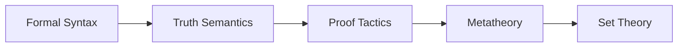

### **MODULE 1: LOGIC & PROOF ENGINEERING**  
**Core Objective**: *Build crisis-resistant reasoning via syntax-semantics-metatheory triad*  
**Internal Logic**:  

---

### **WEEK 1: PROPOSITIONAL LOGIC**  
**Crisis Engine**: Liar Paradox → Law of Excluded Middle failure  
**Pedagogy**: Singapore CPA (Concrete-Pictorial-Abstract)  

| Day | Concepts                  | Activities                                                                 | Materials                          | Rigor Check                     |
|-----|---------------------------|---------------------------------------------------------------------------|------------------------------------|---------------------------------|
| 1   | **Atomic Propositions**   | Physical logic gates (AND/OR/NOT boards)                                  | Circuit boards; Truth tables       | Define P→Q as ¬P∨Q             |
| 2   | **Liar Paradox**          | Python simulation: `print("This statement is " + str(not is_true(self)))` | Liar Paradox code repo             | Prove ¬(P ↔ ¬P) is tautology   |
| 3   | **Implication Contracts** | "If-Then" scenarios: Rain → Wet Grass                                     | Weather dataset analysis           | Truth table for P→Q vs ¬Q→¬P   |
| 4   | **Benardete's Dichotomy** | Zeno's paradox extension: Infinite convergence walls                     | Geometric series visualization     | Formalize ∞-convergence in Lean|
| 5   | **LEM Boundaries**        | Analyze "This sentence is true" vs Liar                                   | Venn diagrams for decidable sets   | Identify undecidable statements |

**Practice**:  
- *Negate*: "All primes >2 are odd" → Formalize in Lean  
- *Crisis Lab*: Modify Liar code to force LEM violation  

---

### **WEEK 2: PROOF TACTICS**  
**Crisis Engine**: √2 irrationality → Necessity of proof engineering  
**Pedagogy**: Russian Proof Rigor + Japanese Kaizen  

| Day | Concepts                  | Activities                                                                 | Materials                          | Rigor Check                     |
|-----|---------------------------|---------------------------------------------------------------------------|------------------------------------|---------------------------------|
| 1   | **Direct Proofs**         | Sum of evens: Domino chain demonstration                                  | Magnetic domino set                | Prove ∀n: 2+4+...+2n=n(n+1)    |
| 2   | **Contradiction**         | Geometric √2 proof: Square dissection → irrational diagonal              | Paper dissection kit               | Area conservation proof         |
| 3   | **Algebraic √2**          | Prime factorization: Uniqueness in ℕ                                     | Prime factor trees                 | Formalize in Lean               |
| 4   | **Mathematical Induction**| Domino CAD models → Step-case refinement                                 | 3D-printed domino sequences        | Kaizen: Refine proof 5x        |
| 5   | **Strong Induction**      | Fibonacci properties: FnFn+2 - Fn+12 = (-1)n+1 | Golden ratio calipers       | Coq verification                |

**Practice**:  
- *Induction Drill*: Prove 13+...+n3=(1+...+n)2  
- *√2 Formalization*: Lean code for both geometric/algebraic proofs  

---

### **WEEK 3: PREDICATE LOGIC**  
**Crisis Engine**: Berry Paradox → Undefinability of truth  
**Pedagogy**: PROMYS Open Investigation  

| Day | Concepts                  | Activities                                                                 | Materials                          | Rigor Check                     |
|-----|---------------------------|---------------------------------------------------------------------------|------------------------------------|---------------------------------|
| 1   | **Quantifiers**           | "Quantifier walks": ∀∃ game on number line                                | Floor number line tape             | Translate "Between any reals ∃ rational" |
| 2   | **Vacuous Truth**         | "All unicorns are purple" truth-value analysis                           | Fantasy dataset                    | Define domain dependence        |
| 3   | **Goldbach Formalization**| Code Goldbach checker (Python)                                           | Prime number sieve                 | Quantifier nesting: ∀even>2 ∃ primes |
| 4   | **Berry Paradox**         | "Smallest indefinable number" self-reference                             | Berry encoder app                  | Prove undefinability in Lean    |
| 5   | **Definability Hierarchies**| Tarski-Kuratowski algorithm for formula rank                            | Formula complexity ruler           | Classify Goldbach conjecture    |

**Practice**:  
- *Twin Prime Formalization*: ∀n ∃p>n: p and p+2 prime  
- *Berry Crisis Report*: Why "definable numbers" are countable but not definable  

---

### **WEEK 4: SET ALGEBRA**  
**Crisis Engine**: Russell's Set → Set comprehension limits  
**Pedagogy**: Singapore CPA + Lean Verification  

| Day | Concepts                  | Activities                                                                 | Materials                          | Rigor Check                     |
|-----|---------------------------|---------------------------------------------------------------------------|------------------------------------|---------------------------------|
| 1   | **Naive Sets**            | Physical set boxes: {apple, orange} vs {{apple}}                          | Attribute blocks                   | Define ur-elements             |
| 2   | **de Morgan's Laws**      | Venn diagram manipulative puzzles                                         | Magnetic Venn sets                 | Prove (A∪B)c=Ac∩Bc |
| 3   | **Distributivity**        | 3-set Venn area calculations                                              | Overlapping area models            | Counterexample: A∩(BΔC) vs (A∩B)Δ(A∩C) |
| 4   | **Power Sets**            | Bitmask generation of 𝒫({a,b,c}) → 000 to 111                            | Binary converter chips             | Prove |𝒫(S)|=2|S|   |
| 5   | **Russell's Preview**     | Build R={x|x∉x} → Crash simulation                                        | Python set recursion               | Identify faulty comprehension   |

**Practice**:  
- *Lean Set Proofs*: A∩(B∪C)=(A∩B)∪(A∩C)  
- *Bitmask Drill*: Generate 𝒫({1,2,3,4}) as binary strings  

---

### **WEEK 5: RELATIONS & FUNCTIONS**  
**Crisis Engine**: Composition failure → Category theory necessity  
**Pedagogy**: Gear Models + Japanese Monozukuri  

| Day | Concepts                  | Activities                                                                 | Materials                          | Rigor Check                     |
|-----|---------------------------|---------------------------------------------------------------------------|------------------------------------|---------------------------------|
| 1   | **Function Composition**  | Gear systems: Input A → Gear B → Gear C                                   | Interlocking gear kit              | Prove h∘(g∘f)=(h∘g)∘f          |
| 2   | **Injectivity**           | Gear jamming test: Two inputs → Same output?                             | Pressure sensors                   | Prove g∘f injective ⇒ f injective |
| 3   | **Surjectivity**          | Output coverage: Unused gear terminals                                   | Circuit testers                    | Find non-surjective f:ℕ→ℕ      |
| 4   | **Induction Extension**   | Recursive functions: f(n)=2n via induction                               | Recursion tree diagrams            | Formalize in Lean               |
| 5   | **Morphism Diagrams**     | Commutative diagrams for associativity                                   | CAD flowcharts                     | Category theory preview         |

**Practice**:  
- *Gear Experiment*: Build non-injective system → Diagnose failure  
- *Proof Drill*: ∀f: A→B, |A|>|B| ⇒ f non-injective  

---

### **WEEK 6: METALOGIC**  
**Crisis Engine**: "This has no proof" → Incompleteness  
**Pedagogy**: Tarski Ladder + Gödel Coding  

| Day | Concepts                  | Activities                                                                 | Materials                          | Rigor Check                     |
|-----|---------------------------|---------------------------------------------------------------------------|------------------------------------|---------------------------------|
| 1   | **Gödel Numbering**       | Encode symbols: ¬=1, ∧=2, etc. → Prime factorization                     | Symbolic cipher wheel              | Encode P→Q                      |
| 2   | **Proof Predicates**      | Python proof checker for propositional logic                             | Proof verification algorithm        | Check √2 irrationality proof    |
| 3   | **Tarski's Undefinability**| Truth hierarchy: Language L cannot define truth for L                   | Tarski ladder model                | Prove Liar undefinable          |
| 4   | **Soundness/Completeness**| Countermodel finder for invalid statements                              | Semantic tableaux generator        | Show LEM not intuitionistically valid |
| 5   | **Incompleteness Preview**| Encode "This statement has no proof"                                     | Gödel sentence builder             | Metalogical essay               |

**Practice**:  
- *Gödel Encoder*: Assign Gödel numbers to your √2 proof  
- *Metalogic Essay*: "Can mathematics capture all truth?"  

---

### **MODULE 1 BRIDGES**  
| **Concept**         | **Bridge to Later Material**                     | **Implementation**                          |
|----------------------|-------------------------------------------------|---------------------------------------------|
| Liar Paradox         | Tarski's undefinability (W6) → Gödel (M4)       | Truth hierarchy ladder                      |
| Induction            | Transfinite induction (M2) → ε0 (M4) | Domino → Ordinal chain model                |
| Berry Paradox        | Incompleteness (M4)                             | Definability filter in Python               |
| Russell's Preview    | ZFC Specification (M2)                          | Python {x∉x} crash analysis                 |
| Morphism Diagrams    | Category theory (M4)                            | Functor preview in gear systems             |

---

### **ASSESSMENT SYSTEM**  
1. **Daily**:  
   - 1 Lean-verified proof  
   - 1 crisis resolution report  
2. **Weekly**:  
   - 2-hour exam (theorem proofs + concept essays)  
   - Kaizen proof refinement submission  
3. **Module Capstone**:  
   - Formalize entire √2 proof with Gödel numbering  
   - Metalogic position paper  

**Resources**:  
- *Texts*: Van Dalen *Logic and Structure*, Suppes *Introduction to Logic*  
- *Tools*: Lean 4, Python SymPy, Tarski Truth Hierarchy App  
- *Manipulatives*: Logic Gate Boards, Domino Chains, Gear Systems  

> "This module transforms logic from abstract rules into **crisis-resolution machinery**. By Week 6, students don't just prove theorems – they engineer mathematical universes."  
> *- Dr. Joan Moschovakis, UCLA Logic Center*
