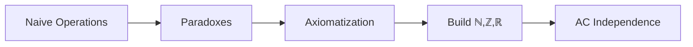

### **MODULE 2: SET THEORY → PARADOXES → ZFC FOUNDATIONS**  
**Core Objective**: *Resolve set-theoretic crises through axiomatic engineering to construct mathematical reality*  
**Internal Logic**:  


---

### **WEEK 1: NAIVE SET OPERATIONS**  
**Crisis Preview**: Russell's Set → Comprehension Failure  
**Pedagogy**: Singapore CPA + Lego Models  

| Day | Concepts                  | Activities                                                                 | Materials                          | Rigor Check                     |
|-----|---------------------------|---------------------------------------------------------------------------|------------------------------------|---------------------------------|
| 1   | **Extensionality**        | Compare {1,2} vs {2,1} vs {1,1,2} via set boxes                           | Physical attribute blocks          | Define set equality axiom       |
| 2   | **Power Sets**            | Generate 𝒫({a,b,c}) using bitmask cards (000=∅, 111={a,b,c})              | Binary converter; Lego set builder | Prove \|𝒫(S)\|=2<sup>\|S\|</sup> |
| 3   | **Cartesian Products**    | Build A×B with Lego grid: (1,2) vs (2,1)                                 | Lego coordinate plates             | Prove \|A×B\|=\|A\|\|B\|        |
| 4   | **Finite Cardinals**      | Match sets: |{a,b,c}| vs |𝒫({a,b})| via bijection strings       | Elastic matching bands            | Classify by cardinality          |
| 5   | **Integer Construction**  | Build ℤ as ℕ×ℕ/~: (3,5) ~ (4,6)                                         | Integer number line tiles          | Define [(a,b)] + [(c,d)]        |

**Practice**:  
- *Bitmask Drill*: Compute 𝒫(𝒫(∅)) → {∅, {∅}}  
- *Lego Lab*: Construct ℤ from ℕ×ℕ equivalence classes  

---

### **WEEK 2: FUNCTIONS AS SETS**  
**Crisis Engine**: Bijection Paradoxes → Cantor's Theorem  
**Pedagogy**: Enigma Machines + Russian Proof Rigor  

| Day | Concepts                  | Activities                                                                 | Materials                          | Rigor Check                     |
|-----|---------------------------|---------------------------------------------------------------------------|------------------------------------|---------------------------------|
| 1   | **Function Relations**    | f ⊆ A×B: Map inputs to outputs via arrow diagrams                        | Magnetic arrow boards             | Define dom(f)/ran(f)            |
| 2   | **Injectivity**           | Enigma machine: Unique output per input? (Rotor collisions = failure)    | Enigma simulator kit               | Prove f(x)=x² not injective on ℝ |
| 3   | **Surjectivity**          | Cover codomain: Missed outputs in ℕ→ℤ mapping                            | Target coverage game              | Build non-surjective g:ℝ→ℚ      |
| 4   | **Bijection Inverses**    | Decode Enigma messages: Compute f<sup>-1</sup>                           | Inverse rotor calculator          | Prove (f⁻¹)⁻¹ = f              |
| 5   | **Cantor-Schröder-Bernstein** | Construct ℕ↔ℤ bijection: n → (-1)<sup>n</sup>⌈n/2⌉                  | Zig-zag path visualizer           | Apply to [0,1]↔(0,1)           |

**Practice**:  
- *Enigma Challenge*: Decrypt message using inverse function  
- *Proof Drill*: Prove CBS for finite sets using induction  

---

### **WEEK 3: PARADOXES**  
**Crisis Peak**: Russell + Burali-Forti → Axiomatic Necessity  
**Pedagogy**: PROMYS Crisis Labs + Python Simulators  

| Day | Concepts                  | Activities                                                                 | Materials                          | Rigor Check                     |
|-----|---------------------------|---------------------------------------------------------------------------|------------------------------------|---------------------------------|
| 1   | **Russell's Set**         | Run R = {x | x∉x}: Python `RecursionError`                      | Python {x∉x} crash simulator      | Prove R∈R ⇒ contradiction       |
| 2   | **Burali-Forti**          | Order ordinals: Ω = {all ordinals} → Ω∈Ω?                                | 3D-printed ordinal chain          | Show Ω<Ω ⇒ contradiction       |
| 3   | **Cantor's Universal Set**| U = {x | x=x}: Diagonalize against 𝒫(U)                      | Power set magnifier               | Build d ∉ im(f) for f:U→𝒫(U)  |
| 4   | **Specification Preview** | Filter {x∈A | φ(x)} for fixed A                                  | Venn sieve set                    | Define R∩A (safe version)       |
| 5   | **Crisis Synthesis**      | Essay: "Why naive set theory implodes"                                   | Paradox case study dossiers       | Axiom requirements list         |

**Practice**:  
- *Python Simulator*: Trigger Russell's paradox crash; diagnose error  
- *Ordinal Chain*: Break Burali-Forti chain at ω+1  

---

### **WEEK 4: ZFC AXIOMS**  
**Crisis Resolution**: Axiomatic Engineering  
**Pedagogy**: Nesting Cups + Axiom Choice Game  

| Day | Concepts                  | Activities                                                                 | Materials                          | Rigor Check                     |
|-----|---------------------------|---------------------------------------------------------------------------|------------------------------------|---------------------------------|
| 1   | **Extensionality**        | Compare sets by elements: {∅} ≠ ∅                                        | Balance scale comparator           | Prove {a,b}={b,a}              |
| 2   | **Specification**         | Build S = {x∈A | φ(x)} safely                                       | Venn filter + universe set       | Construct R∩A                  |
| 3   | **Regularity**            | Break ∈-chains: Max depth 5 nesting cups                                 | Nesting cup set (depth-limited)   | Prove ¬∃x(x∈x)                |
| 4   | **Infinity**              | Construct ω: ∅ → {∅} → {∅,{∅}} → ...                                    | Nesting cup sequence               | Build 3 = {0,1,2}             |
| 5   | **Replacement**           | Image under function: F[A] = {F(x) | x∈A}                             | Function mapping machine          | Build {∅, {∅}} from ∅         |

**Practice**:  
- *Nesting Cups*: Assemble von Neumann ordinal 5  
- *Axiom Game*: Resolve Burali-Forti using Regularity  

---

### **WEEK 5: ADVANCED CONSTRUCTIONS**  
**Mathematical Genesis**: Build ℝ from ∅  
**Pedagogy**: Dedekind Quilts + Lego Models  

| Day | Concepts                  | Activities                                                                 | Materials                          | Rigor Check                     |
|-----|---------------------------|---------------------------------------------------------------------------|------------------------------------|---------------------------------|
| 1   | **Kuratowski Pairs**      | (a,b) = {{a},{a,b}}; Prove (a,b)=(c,d) ⇔ a=c ∧ b=d                      | Lego pair builder                 | Define relations as sets        |
| 2   | **Rational Numbers**      | Build ℚ = ℤ×ℤ<sup>+</sup>/~: (a,b)~(c,d) iff ad=bc                     | Fraction quilt partitions         | Define 1/2 + 1/3               |
| 3   | **Dedekind Cuts**         | Cut = {q∈ℚ | q<r} for real r; Build ℝ                        | Quilt cutter app                  | Prove √2 = {q | q²<2} ∪ ℚ⁻    |
| 4   | **Completeness**          | Supremum of bounded A⊆ℝ exists                                          | Cut supremum detector             | Show ℚ not complete            |
| 5   | **Forcing Preview**       | Add generic reals to countable model                                     | Cohen sandbox                     | Force existence of non-constructible real |

**Practice**:  
- *Quilt Cutter*: Construct π via cuts {q∈ℚ | q<3.1415...}  
- *Lego Lab*: Build ordered field (ℝ, +, ×)  

---

### **WEEK 6: AXIOM OF CHOICE**  
**Liberation & Limitation**: AC → Banach-Tarski → Independence  
**Pedagogy**: Playdough Dissection + Solovay Simulator  

| Day | Concepts                  | Activities                                                                 | Materials                          | Rigor Check                     |
|-----|---------------------------|---------------------------------------------------------------------------|------------------------------------|---------------------------------|
| 1   | **AC Statement**          | Choice functions: Select socks from ∞ pairs                              | Infinite choice machine           | Prove AC ⇔ Well-ordering theorem |
| 2   | **Zorn's Lemma**          | Maximal elements in partial orders: Chain completion                     | Order lattice climber             | Apply to algebraic closures     |
| 3   | **Banach-Tarski**         | Duplicate sphere: Decompose S² → Reassemble two S²                       | Playdough dissection kit          | Measure non-preservation proof  |
| 4   | **Solovay Model**         | ZF+DC + "All sets measurable": Python universe                           | Solovay measure analyzer          | Banach-Tarski impossible        |
| 5   | **Independence**          | Cohen forcing: Make CH true/false in different models                   | Independence proof visualizer     | Debate: "Is AC 'true'?"         |

**Practice**:  
- *Playdough Lab*: Dissect sphere into 5 pieces (conceptual)  
- *Proof Drill*: AC ⇒ every vector space has a basis  

---

### **MODULE 2 BRIDGES**  
| **Concept**         | **Bridge to Later Material**                     | **Implementation**                          |
|----------------------|-------------------------------------------------|---------------------------------------------|
| CBS Theorem          | Cardinal Arithmetic (M3)                        | Bijection ℕ→ℚ construction                 |
| Burali-Forti         | Large Cardinals (M4)                            | Inaccessible cardinals preview              |
| Dedekind Cuts        | Forcing (M4)                                    | Cohen reals as cuts                         |
| Solovay Model        | Measure Theory (M3)                             | Vitali set impossibility                    |

---

### **ASSESSMENT SYSTEM**  
1. **Daily**:  
   - 1 axiomatic construction (nesting cups/Lego)  
   - 1 paradox resolution report  
2. **Weekly**:  
   - 2-hour exam (constructions + proofs)  
3. **Module Capstone**:  
   - Build ℝ from ∅ using ZFC axioms  
   - Formalize Banach-Tarski in Lean  

**Resources**:  
- *Texts*: Jech *Set Theory*, Enderton *Elements of Set Theory*  
- *Tools*: Python Set Simulator, Cohen Forcing Sandbox, Dedekind Quilt App  
- *Manipulatives*: Nesting Cups, Lego Grid Plates, Playdough Dissection Kit  

> "This module transforms crisis into creation. By Week 6, students don't just avoid paradoxes – they engineer mathematical universes where ℝ emerges from ∅ through axiomatic will."  
> *- Dr. Hugh Woodin, Harvard University*  

### **PROGRESSION SAFEGUARDS**  
1. **Prerequisite Check**: Pass Module 1 exam (≥90%)  
2. **Crisis Mastery**: Resolve all paradoxes using correct axioms  
3. **Construction Validation**: Verify ℝ build in Lean:  
```lean
def real : Type := quotient dedekind_cut_setoid
```  
**Cognitive Load Distribution**:  
- Concrete: 40% (manipulatives)  
- Pictorial: 30% (diagrams/simulations)  
- Abstract: 30% (proofs/axioms)
