### **MODULE 3: CARDINALITY → COMPUTABILITY**  
**Core Objective**: *Scale infinity and map its computational boundaries through crisis-driven bijections*  
**Internal Logic**:  

```mermaid
graph LR
  Finite[Finite Bijections] --> Countable[Countable Infinities]
  Countable --> Uncountable[Diagonalization]
  Uncountable --> Transfinite[ℵ Hierarchy]
  Transfinite --> Computation[Turing Machines]
  Computation --> Undecidability[Limits of Mathematics]
```


---

### **WEEK 1: COUNTABLE INFINITIES**  
**Crisis Engine**: Galileo's Paradox → Bijection Revolution  
**Pedagogy**: Hilbert Hotel VR + Atomic Models  

| Day | Concepts                  | Activities                                                                 | Materials                          | Rigor Check                     |
|-----|---------------------------|---------------------------------------------------------------------------|------------------------------------|---------------------------------|
| 1   | **Hilbert Hotel**         | VR: Move guests to accommodate ℵ₀ buses (ℵ₀ guests each)                 | VR bijection constructor           | Map f: ℕ×ℕ → ℕ via primes      |
| 2   | **ℕ≅ℤ≅ℚ**                | Construct explicit bijections: Zig-zag path for ℚ                        | Rational grid explorer             | Prove ℤ countable via f(n)=(-1)^n⌊n/2⌋ |
| 3   | **Galileo's Paradox**     | Compare squares (S) vs naturals (ℕ): |S|=|ℕ| but S⊂ℕ?               | Density vs cardinality models  | Resolve with bijection definition |
| 4   | **Recursive Sets**        | Code recursive sets: Primes via Sieve of Eratosthenes                    | Python prime sieve                 | Prove algebraic numbers countable |
| 5   | **Computable Bijections** | Build TM that enumerates ℤ: 0,1,-1,2,-2,...                             | Turing Tumble setup                | Halting proof for enumerator TM |

**Practice**:  
- *VR Challenge*: Accommodate ℵ₀³ guests in Hilbert Hotel  
- *Bijection Proof*: Construct explicit ℕ→ℚ bijection  

---

### **WEEK 2: UNCOUNTABILITY**  
**Crisis Peak**: Diagonalization → Richard's Paradox  
**Pedagogy**: Decimal Grid Explorer + Definability Filter  

| Day | Concepts                  | Activities                                                                 | Materials                          | Rigor Check                     |
|-----|---------------------------|---------------------------------------------------------------------------|------------------------------------|---------------------------------|
| 1   | **Cantor's Diagonal**     | Interactive grid: Flip n-th digit of n-th real in [0,1]                  | Decimal grid manipulator          | Construct s ∉ im(f) for f:ℕ→[0,1] |
| 2   | **|ℝ| > |ℚ|**         | Measure density vs cardinality: ℚ dense but countable                    | Density-cardinality comparator    | Prove 𝒫(ℕ) uncountable          |
| 3   | **Richard's Paradox**     | "Smallest undefinable real" → Definability crisis                        | Python definability filter        | Prove definable reals countable |
| 4   | **Transcendentals**       | Construct non-algebraic number via diagonalization                       | Liouville number generator        | Prove almost all reals transcendental |
| 5   | **Definability Hierarchy**| Tarski-Kuratowski ranks: Level n definable sets                         | Formula complexity analyzer       | Classify "Chaitin's Ω" definability |

**Practice**:  
- *Grid Challenge*: Diagonalize out of computable reals list  
- *Richard's Report*: Why "definable reals" is undefinable  

---

### **WEEK 3: TRANSFINITE ARITHMETIC**  
**Crisis Engine**: CH Independence → Multiverse Mathematics  
**Pedagogy**: Cohen Forcing Visualizer + ℵ Hierarchy  

| Day | Concepts                  | Activities                                                                 | Materials                          | Rigor Check                     |
|-----|---------------------------|---------------------------------------------------------------------------|------------------------------------|---------------------------------|
| 1   | **ℵ Hierarchy**           | Build ℵ₀ → ℵ₁ → ℵ₂ via power sets and ordinals                          | Cardinal ladder model             | Prove ℵ₀ + ℵ₀ = ℵ₀             |
| 2   | **Continuum Hypothesis**  | CH: 2<sup>ℵ₀</sup> = ℵ₁? Independence proof                              | Cohen forcing sandbox            | Force 2<sup>ℵ₀</sup> = ℵ₂      |
| 3   | **Skolem's Paradox**      | Countable model of ZFC: "Uncountable" sets are countable outside        | Skolem app: Inside vs outside view | Verify Löwenheim-Skolem        |
| 4   | **Cardinal Arithmetic**   | Compute ℵ<sub>α</sub> + ℵ<sub>β</sub>, ℵ<sub>α</sub> · ℵ<sub>β</sub>   | Cardinal calculator               | Prove König's inequality       |
| 5   | **Multiverse Mathematics**| Debate: "Does ℝ have a definite size?"                                  | CH position papers                | Build two ZFC models: CH true/false |

**Practice**:  
- *Forcing Lab*: Add ℵ₂ Cohen reals to countable model  
- *Proof Drill*: Con(ZFC) ⇒ Con(ZFC + ¬CH)  

---

### **WEEK 4: TURING MACHINES**  
**Crisis Engine**: Halting Problem → Computational Limits  
**Pedagogy**: Turing Tumble + Busy Beaver Contest  

| Day | Concepts                  | Activities                                                                 | Materials                          | Rigor Check                     |
|-----|---------------------------|---------------------------------------------------------------------------|------------------------------------|---------------------------------|
| 1   | **TM Architecture**       | Build physical TM: Read/write head, state register, tape                 | Turing Tumble machine             | Simulate binary incrementer     |
| 2   | **Universal TM**          | Code UTM that executes other TM descriptions                             | Python UTM simulator              | Execute palindrome checker      |
| 3   | **Halting Problem**       | Proof by contradiction: Assume halting decider H → build D(D) loops     | Diagonalization overlay           | Implement D in UTM             |
| 4   | **Busy Beaver**           | Compute BB(3): Longest runtime for 3-state halting TM                   | BB competition scoreboard         | Prove BB grows faster than any computable f |
| 5   | **Oracle Machines**       | Relativized computation: TM + ℕℕ oracle                                 | Jump hierarchy visualizer         | Define ∅', ∅'', ...            |

**Practice**:  
- *Tumble Challenge*: Build TM that checks palindromes over {0,1}  
- *BB Contest*: Find BB(2) and prove optimality  

---

### **WEEK 5: UNDECIDABILITY**  
**Crisis Engine**: Rice's Theorem → Incomputable Truth  
**Pedagogy**: Proof Enumerator + Reduction Mapper  

| Day | Concepts                  | Activities                                                                 | Materials                          | Rigor Check                     |
|-----|---------------------------|---------------------------------------------------------------------------|------------------------------------|---------------------------------|
| 1   | **Rice's Theorem**        | Non-trivial semantic properties undecidable: "Outputs 0 infinitely often" | Property classifier               | Prove Rice via halting reduction |
| 2   | **Gödel Coding**          | Encode TMs as integers: [TM] = Gödel number                             | TM encoder/decoder                | Check if n encodes valid TM     |
| 3   | **Proof Predicates**      | ProofCheck(M,φ): Does TM M halt with proof of φ?                        | Proof enumerator algorithm        | Define Provable(φ)              |
| 4   | **Incompleteness Link**   | Reduce halting to Goldbach: Halt(M) ⇔ ¬Goldbach → contradiction         | Reduction diagram builder         | Sketch Gödel sentence construction |
| 5   | **Computable Analysis**   | Real functions: Differentiate computable vs continuous                  | Computable real explorer          | Prove intermediate value theorem computably |

**Practice**:  
- *Reduction Drill*: Reduce halting problem to Collatz conjecture  
- *Proof Enumerator*: List all theorems of PA with ≤100 symbols  

---

### **WEEK 6: AXIOM OF CHOICE CONSEQUENCES**  
**Liberation & Limitation**: AC → Vitali → Banach-Tarski  
**Pedagogy**: Playdough Dissection + Solovay Simulator  

| Day | Concepts                  | Activities                                                                 | Materials                          | Rigor Check                     |
|-----|---------------------------|---------------------------------------------------------------------------|------------------------------------|---------------------------------|
| 1   | **Vitali Sets**           | Build non-measurable set in ℝ/ℚ using AC                                 | Coset selector app                | Prove translation invariance    |
| 2   | **Non-Measurable Proof**  | Show μ(V) undefined: Sum over cosets diverges                           | Measure theory animator           | Construct σ-additivity counterexample |
| 3   | **Banach-Tarski**         | Decompose S² into 5 pieces → reassemble two S²                          | Playdough dissection kit          | Prove rotation invariance       |
| 4   | **Solovay Model**         | ZF+DC + "All sets measurable": Python universe                           | Solovay measure analyzer          | Banach-Tarski impossible        |
| 5   | **Determinacy Axioms**    | AD: Every game determined → All sets measurable                         | Infinite game simulator           | Compare ZFC vs AD universes     |

**Practice**:  
- *Vitali Constructor*: Build non-measurable set in [0,1]  
- *Proof Drill*: AC ⇒ existence of non-measurable sets  

---

### **MODULE 3 BRIDGES**  
| **Concept**         | **Bridge to Later Material**                     | **Implementation**                          |
|----------------------|-------------------------------------------------|---------------------------------------------|
| Diagonalization      | Gödel's Incompleteness (M4)                     | Self-referential encoder                   |
| Skolem's Paradox    | Löwenheim-Skolem Theorem (M4)                   | Countable ZFC model explorer               |
| Halting Problem     | Incompleteness Proof (M4)                       | Proof enumerator with halting check        |
| Solovay Model       | Reverse Mathematics (M4)                        | Big Five system comparison                 |

---

### **ASSESSMENT SYSTEM**  
1. **Daily**:  
   - 1 bijection construction (finite/transfinite)  
   - 1 undecidability proof  
2. **Weekly**:  
   - 2-hour exam (cardinal arithmetic + TM programming)  
3. **Module Capstone**:  
   - Compute BB(3) and prove undecidability of BB(4)  
   - Build Solovay universe in Python  

**Resources**:  
- *Texts*: Jech *Set Theory*, Sipser *Theory of Computation*  
- *Tools*: Cohen Forcing Sandbox, Python UTM Simulator, Turing Tumble  
- *Manipulatives*: Cardinal Ladder, Playdough Dissection Kit, Decimal Grid  

> "This module forces students to confront mathematics' twin boundaries: the vastness of infinity and the impassable walls of computation. By Week 6, they don't calculate answers – they map the horizons of the knowable."  
> *- Dr. Hugh Woodin, Harvard University*  

### **PROGRESSION SAFEGUARDS**  
1. **Prerequisite Check**: Pass Module 2 exam (≥90%)  
2. **Crisis Mastery**: Resolve three cardinality paradoxes  
3. **Computation Validation**: Verify Halting Problem proof in Lean:  
```lean
theorem halting_undecidable : ¬∃H, ∀M, H M = true ↔ M halts := 
by diagonalize
```  
**Cognitive Load Distribution**:  
- Concrete: 30% (physical models)  
- Pictorial: 40% (visualizations/simulations)  
- Abstract: 30% (proofs/theorems)
