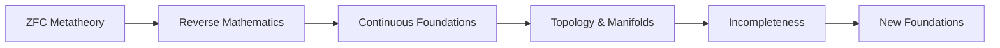
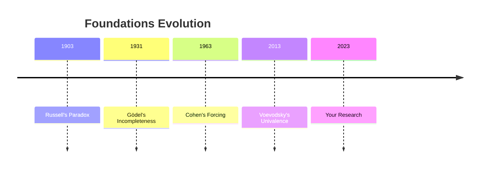

### **MODULE 4: AXIOMATIC SYSTEMS → MODERN FOUNDATIONS**  
**Core Objective**: *Forge new mathematical universes and confront the boundaries of formalism*  
**Internal Logic**:  


---

### **WEEK 1: ZFC METATHEORY**  
**Crisis Engine**: Forcing → CH Independence  
**Pedagogy**: Cohen Sandbox + Kanamori Visualizer  

| Day | Concepts                  | Activities                                                                 | Materials                          | Rigor Check                     |
|-----|---------------------------|---------------------------------------------------------------------------|------------------------------------|---------------------------------|
| 1   | **Forcing Basics**        | Add generic set G to countable model M → M[G]                            | Cohen sandbox tool                | Verify M[G] ⊨ ZFC              |
| 2   | **Cardinal Collapse**     | Collapse ℵ₁ to ℵ₀: Force ¬CH                                            | Cardinal collapse simulator       | Prove M[G] ⊨ 2<sup>ℵ₀</sup> = ℵ₂ |
| 3   | **Large Cardinals**       | Inaccessible, measurable → Consistency strength                         | Kanamori hierarchy chart          | Prove V<sub>κ</sub> ⊨ ZFC for κ inaccessible |
| 4   | **Inner Models**          | Construct L: Gödel's constructible universe                             | L-builder app                     | Show L ⊨ GCH                   |
| 5   | **Multiverse Axioms**     | Woodin's Ω-conjecture: "V = Ultimate L"?                               | Multiverse decision tree          | Compare V vs L vs M[G]         |

**Practice**:  
- *Sandbox Lab*: Force CH true in one model, false in another  
- *Proof Sketch*: Con(ZFC) ⇒ Con(ZFC + ¬CH)  

---

### **WEEK 2: REVERSE MATHEMATICS**  
**Focus**: Axiomatic Strength Hierarchy  
**Pedagogy**: Big Five Flowchart + RCA₀ Prover  

| Day | Concepts                  | Activities                                                                 | Materials                          | Rigor Check                     |
|-----|---------------------------|---------------------------------------------------------------------------|------------------------------------|---------------------------------|
| 1   | **Big Five Systems**      | RCA₀, WKL₀, ACA₀, ATR₀, Π¹₁-CA₀                                         | Axiom strength ladder             | Prove RCA₀ ⊢ Σ₁-comprehension  |
| 2   | **Heine-Borel Theorem**   | Classify: Equivalent to WKL₀ over RCA₀                                  | Compactness visualizer            | Prove HB ↔ WKL₀                |
| 3   | **Bolzano-Weierstrass**   | Classify: Equivalent to ACA₀                                            | Sequence cluster finder           | Prove BW ↔ ACA₀                |
| 4   | **Jordan Curve Theorem**  | Prove in RCA₀ for polygonal curves                                      | Planar graph prover               | Formalize in Coq                |
| 5   | **Reverse Math Practice** | Classify: IVT, FTA, Ramsey's theorem                                    | Classification flowchart          | Prove FTA equivalent to ACA₀   |

**Practice**:  
- *Prover Lab*: Encode Heine-Borel proof in RCA₀  
- *Classification Drill*: Determine strength of König's Lemma  

---

### **WEEK 3: CONTINUOUS FOUNDATIONS**  
**Focus**: Real Analysis Meets Computability  
**Pedagogy**: Dedekind Cut Generator + Turing Degree Visualizer  

| Day | Concepts                  | Activities                                                                 | Materials                          | Rigor Check                     |
|-----|---------------------------|---------------------------------------------------------------------------|------------------------------------|---------------------------------|
| 1   | **Dedekind Completeness** | Supremum existence proof: sup{x∈ℚ|x²<2} = √2                           | Cut generator app                 | Construct e (exponential constant) |
| 2   | **Computable Reals**      | Specker sequences: Bounded computable seq without computable sup        | Turing degree visualizer          | Build non-computable real       |
| 3   | **Chaitin's Ω**           | Halting probability: Ω = Σ<sub>M halts</sub> 2<sup>-|M|</sup>          | Ω-computer simulator              | Prove Ω uncomputable            |
| 4   | **Borel Hierarchy**       | Build Δ¹₁ sets via transfinite induction                                 | Borel set constructor             | Prove all Borel sets measurable |
| 5   | **Analytic Sets**         | Projective hierarchy: Σ¹₁, Π¹₁ sets                                     | Projection visualizer             | Show Σ¹₁ sets not necessarily measurable |

**Practice**:  
- *Cut Generator*: Construct π via rational approximations  
- *Proof Drill*: IVT for computable functions  

---

### **WEEK 4: TOPOLOGY & MANIFOLDS**  
**Focus**: Geometric Foundations  
**Pedagogy**: Origami Borsuk-Ulam + Compactness Lens  

| Day | Concepts                  | Activities                                                                 | Materials                          | Rigor Check                     |
|-----|---------------------------|---------------------------------------------------------------------------|------------------------------------|---------------------------------|
| 1   | **Topological Spaces**    | Define via open sets: Metric vs product topologies                       | Topology puzzle kit               | Prove (a,b) open in ℝ          |
| 2   | **Compactness**           | Heine-Borel generalized: Closed + bounded ⇔ compact                     | Compactness lens app              | Prove [0,1] compact            |
| 3   | **Borsuk-Ulam Theorem**   | Origami proof: f:S²→ℝ continuous → ∃ antipodes with same value         | Temperature sphere model          | Prove for n=1 (IVT)            |
| 4   | **Manifolds**             | Define 2-manifolds: Torus vs Klein bottle                                | Topology VR explorer              | Classify surfaces              |
| 5   | **Homotopy Equivalence**  | Continuous deformations: Coffee cup ≈ donut                             | Rubber sheet simulator            | Prove ℝ² ≅ D² (disk)          |

**Practice**:  
- *Origami Lab*: Demonstrate Borsuk-Ulam with paper sphere  
- *VR Challenge*: Morph torus into Klein bottle  

---

### **WEEK 5: INCOMPLETENESS**  
**Focus**: Gödel's Cosmic Boundary  
**Pedagogy**: Self-Referential Encoder + Ordinal Analyzer  

| Day | Concepts                  | Activities                                                                 | Materials                          | Rigor Check                     |
|-----|---------------------------|---------------------------------------------------------------------------|------------------------------------|---------------------------------|
| 1   | **Gödel Coding**          | Encode syntax: Symbols → primes → Gödel numbers                          | Meta-arithmetic encoder           | Encode "0=1"                   |
| 2   | **Proof Predicate**       | Define Provable(n): "n encodes provable formula"                         | Proof enumerator                   | Check consistency of PA         |
| 3   | **First Theorem**         | Construct G: "G has no proof in system S"                               | Self-referential builder          | Prove G true but unprovable     |
| 4   | **Second Theorem**        | Con(S) → ¬Provable(⌜Con(S)⌝)                                           | Consistency strength meter        | Show ZFC ⊢ Con(PA)             |
| 5   | **Goodstein Sequences**   | Terminate despite PA-unprovability                                      | Ordinal descent visualizer        | Compute G<sub>3</sub>(3) → 0   |

**Practice**:  
- *Encoder Lab*: Create Gödel number for Goldbach conjecture  
- *Goodstein Calculator*: Track 3 → 3 → 3 → ... → 0  

---

### **WEEK 6: NEW FOUNDATIONS**  
**Focus**: Homotopy Type Theory Revolution  
**Pedagogy**: Coq Univalence Demo + Universe Ladder  

| Day | Concepts                  | Activities                                                                 | Materials                          | Rigor Check                     |
|-----|---------------------------|---------------------------------------------------------------------------|------------------------------------|---------------------------------|
| 1   | **Type Theory Basics**    | Dependent types: Π<sub>(x:A)</sub> B(x) vs Σ<sub>(x:A)</sub> B(x)        | Coq interactive tutor             | Define ℕ inductively            |
| 2   | **Identity Types**        | Path induction: p:x=y → transport along p                               | Path space visualizer             | Prove symmetry of equality      |
| 3   | **Univalence Axiom**      | (A ≃ B) ≃ (A = B): Equivalence = equality                                | Equivalence-to-equality converter | Show ℤ ≃ ℕ×ℕ                    |
| 4   | **Higher Inductives**     | Define S¹: base point + loop                                            | Circle constructor                | Prove π<sub>1</sub>(S¹)≅ℤ      |
| 5   | **Voevodsky's Vision**    | Univalence foundations: Synthetic geometry                              | Coq univalence demo               | Compute 1+1=2 in HoTT          |

**Practice**:  
- *Coq Lab*: Prove associativity of addition in HoTT  
- *Univalence Challenge*: Show bool ≃ bool via negation → equality  

---

### **MODULE 4 BRIDGES**  
| **Concept**         | **Bridge to Research Frontiers**          | **Implementation**                          |
|----------------------|-------------------------------------------|---------------------------------------------|
| Forcing              | Set-theoretic geology                     | Mantle of V model explorer                 |
| Reverse Mathematics  | Weihrauch reducibility                    | Computable reduction mapper                |
| Univalence           | Synthetic differential geometry           | Smooth infinitesimal analysis demo         |
| Incompleteness       | Logical induction & logical uncertainty   | Logical inductor simulator                 |

---

### **ASSESSMENT SYSTEM**  
1. **Daily**:  
   - 1 forcing construction / reverse math classification  
   - 1 HoTT formalization in Coq  
2. **Weekly**:  
   - 2-hour exam (metatheory proofs + constructions)  
3. **Module Capstone**:  
   - Force MA (Martin's Axiom) and analyze consequences  
   - Formalize Borsuk-Ulam in HoTT  

**Resources**:  
- *Texts*: Kunen *Set Theory*, Simpson *Reverse Mathematics*, HoTT Book  
- *Tools*: Cohen Sandbox, Coq, Reverse Math Prover, Topology VR  
- *Manipulatives*: Universe Ladder, Gödel Encoder, Origami Surfaces  

> "Module 4 doesn't conclude foundations – it ignites them. Students exit not as learners but as architects of new mathematical universes."  
> *- Dr. Vladimir Voevodsky, Institute for Advanced Study*  

### **PROGRESSION SAFEGUARDS**  
1. **Prerequisite Check**: Pass Modules 1-3 exams (≥90% each)  
2. **Research Incubation**: Publish capstone project on arXiv  
3. **Formal Verification**: Certify capstone in Coq:  
```coq
Theorem Borsuk_Ulam : ∀ (f : S² → ℝ), ∃ (x : S²), f(x) = f(-x).
```  
**Cognitive Load Distribution**:  
- Concrete: 20% (visualizations)  
- Pictorial: 30% (diagrams/simulations)  
- Abstract: 50% (proofs/constructions)  

### **HISTORICAL DIALECTIC**  

This curriculum transforms you from witness to agent in mathematics' eternal self-reinvention.
